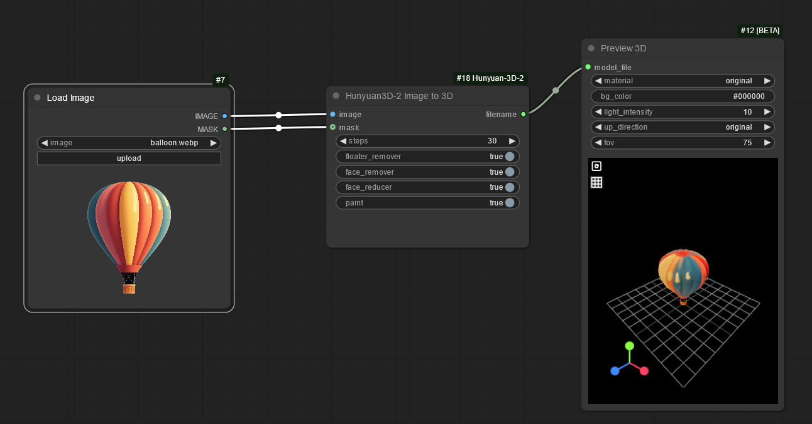

This is a custom\_node for [ComfyUI](https://github.com/comfyanonymous/ComfyUI).  It converts an image into a 3D file you can import into Blender or whatever 3d software you use.  It uses [Hunyuan-3D-2](https://github.com/Tencent/Hunyuan3D-2) from Tencent.

Make sure you use an image with a transparent background.

This custom node might fail after the first restart.  Restart ComfyUI again.  Click on the panel ~~☐~~ to look for errors.


## If it doesn't install...

### Ubuntu 

`sudo apt install python3-dev libgl-dev`

### Suse

Hunyuan-3D needs g++ 13, Suse has g++ 14+ by default

`sudo zypper install g++-13 Mesa-libGL-devel python3-dev`

## Usage...

* [Example workflow](examples/)
* When you run it for the first time it will download the models which will take a long time.  Press the panel button on the top right ~~☐~~ to see the progress.
* Put the input image into the "input" folder.  It must have a transparent background.
* The 3D .glb file is saved in "output" after you run it.

## Workarounds...

* If you get a square panel.  Make sure you have a transparent background in the image.  If the image came from another node, insert an "invert mask" node before giving the mask to this node, some nodes have a mask that's reversed.
* Hunyuan-3D-2 uses more main memory than GPU memory.  On a 16gb RAM main memory computer, you'll have to quit everything else other than ComfyUI, have only a few custom\_nodes installed.  Or use the command line version.  I have ran it on 16gb RAM, 8gb VRAM without paint.  Best to have 24gb+ RAM, 12gb+ VRAM.


### Install from git.  

Not recommended because ComfyUI-Manager will auto update when you press the update button. git will need manual updates for every custom\_node you have.

```
cd custom_nodes
git clone https://github.com/niknah/ComfyUI-Hunyuan-3D-2
pip install -r requirements.txt
cd ComfyUI-Hunyuan-3D-2
git submodule update --init   # You need to get the submodules if you install from git
```



